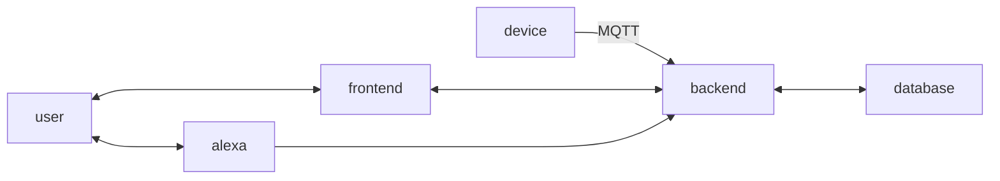

# RoomSense
Monitoring of Room Temperature and Air Quality

To efficiently monitor room conditions, rooms are equipped with sensors for temperature and carbon dioxide (CO2). These sensors continuously capture data, which is collected by an Arduino and transmitted to a central server using the MQTT protocol. The captured data is accessible through a user-friendly web application. This platform not only enables _(near)_ real-time monitoring, but also provides automated recommendations for optimal ventilation times, based on the current air quality and temperature. In addition to the web application, users can directly receive recommendations for the next ventilation time via a specially developed Alexa skill, accessed by voice command. This increases the comfort and accessibility of the data for all users.

Another feature is an alarm system that is activated when critical air quality values are reached. This alarm warns the occupants of potentially hazardous conditions and suggests immediate measures to improve the indoor air quality.

## IOT Device Specifications

### Microcontroller Board
- We use the Arduino Uno R3, a popular open-source microcontroller board.
- The Arduino Uno R3 features an ATmega328P microcontroller and provides Wi-Fi connectivity to establish an internet connection.

### Sensors

#### Temperature and Humidity Sensor: DHT11
- The DHT11 is a basic, low-cost digital temperature and humidity sensor.
- It provides reliable temperature and humidity readings with good accuracy.
- Detailed information on the DHT11 sensor pinout, features, and datasheet can be found on [Components101.com](https://components101.com/sensors/dht11-temperature-sensor#:~:text=The%20DHT11%20is%20a%20commonly,and%20humidity%20as%20serial%20data.).

#### Gas Sensor: MQ-135
- The MQ-135 is a gas sensor that can detect a variety of gases, such as NH3, NOx, alcohol, benzene, smoke, and CO2.
- It is a cost-effective solution for monitoring air quality.
- More information on the MQ-135 gas sensor module can be found on the [AZ-Delivery website](https://www.az-delivery.de/products/mq-135-gas-sensor-modul).

By using the Arduino Uno R3 as the microcontroller board and integrating the DHT11 temperature/humidity sensor and MQ-135 gas sensor, this IOT device can effectively monitor environmental conditions and air quality.

Here's an improved version of the MQTT Broker information:

## MQTT Broker
[HiveMQ Cloud](https://console.hivemq.cloud/)
Cluster URL: `c93e99eaf93b4f81aa4db3ba6fee2780.s1.eu.hivemq.cloud`
TLS MQTT Port: `8883`
WebSocket Port: `8884`

TLS MQTT URL: `c93e99eaf93b4f81aa4db3ba6fee2780.s1.eu.hivemq.cloud:8883`
TLS WebSocket URL: `c93e99eaf93b4f81aa4db3ba6fee2780.s1.eu.hivemq.cloud:8884/mqtt`

MQTT Topics:
- Humidity: `room/humidity`
- Temperature: `room/temperature`

