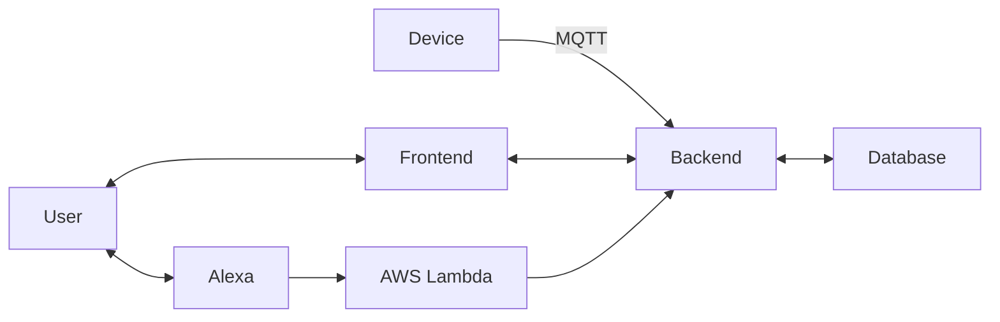
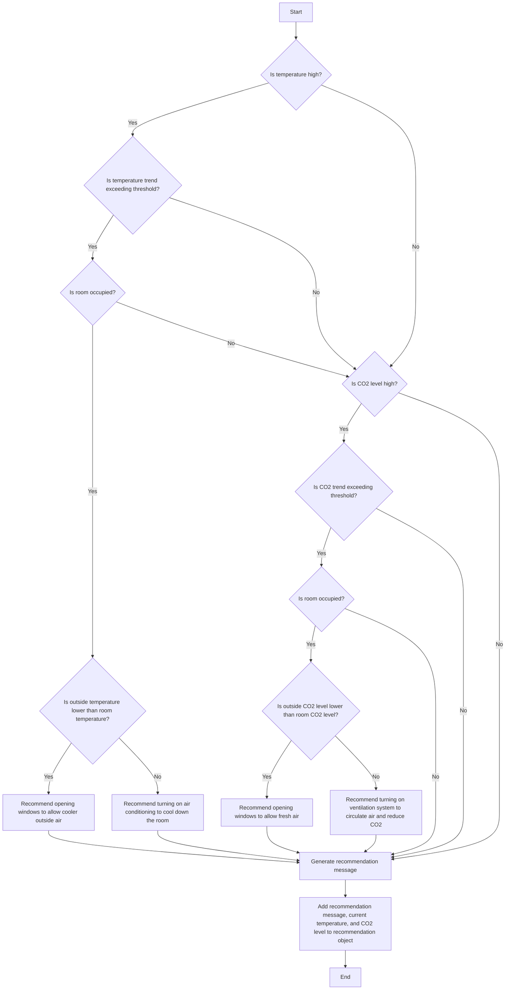
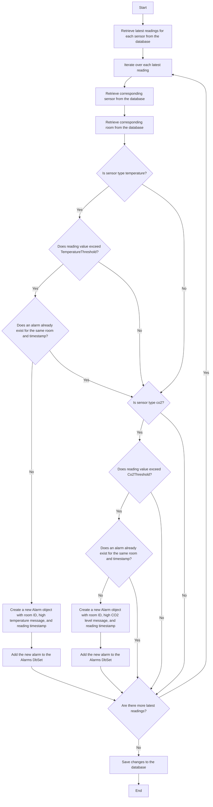
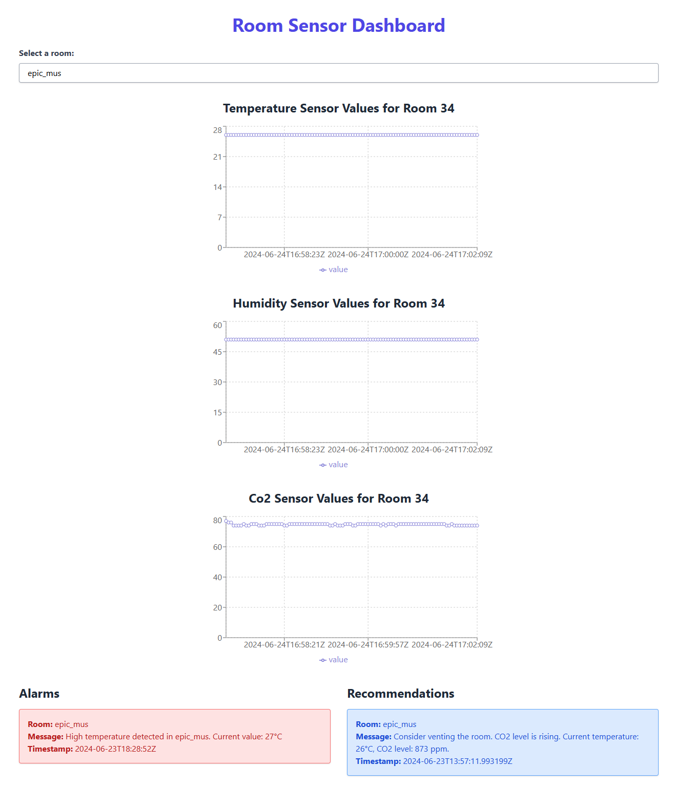
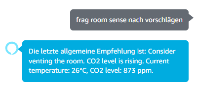

# RoomSense


Monitoring of Room Temperature and Air Quality

Demo at https://iot.xaverb.dev

To efficiently monitor room conditions, rooms are equipped with sensors for temperature and carbon dioxide (CO2). These sensors continuously capture data, which is collected by an Arduino and transmitted to a central server using the MQTT protocol. The captured data is accessible through a user-friendly web application. This platform not only enables _(near)_ real-time monitoring, but also provides automated recommendations for optimal ventilation times, based on the current air quality and temperature. In addition to the web application, users can directly receive recommendations for the next ventilation time via a specially developed Alexa skill, accessed by voice command. This increases the comfort and accessibility of the data for all users.

Another feature is an alarm system that is activated when critical air quality values are reached. This alarm warns the occupants of potentially hazardous conditions and suggests immediate measures to improve the indoor air quality.



## IOT Device Specifications

### Microcontroller Board
- We use the Arduino Uno R3, a popular open-source microcontroller board.
- The Arduino Uno R3 features an ATmega328P microcontroller and provides Wi-Fi connectivity to establish an internet connection.

### Sensors

#### Temperature and Humidity Sensor: DHT11
- The DHT11 is a basic, low-cost digital temperature and humidity sensor.
- It provides reliable temperature and humidity readings with good accuracy.
- Detailed information on the DHT11 sensor pinout, features, and datasheet can be found on [Components101.com](https://components101.com/sensors/dht11-temperature-sensor#:~:text=The%20DHT11%20is%20a%20commonly,and%20humidity%20as%20serial%20data.).

#### Gas Sensor: MQ-135
- The MQ-135 is a gas sensor that can detect a variety of gases, such as NH3, NOx, alcohol, benzene, smoke, and CO2.
- It is a cost-effective solution for monitoring air quality.
- More information on the MQ-135 gas sensor module can be found on the [AZ-Delivery website](https://www.az-delivery.de/products/mq-135-gas-sensor-modul).

By using the Arduino Uno R3 as the microcontroller board and integrating the DHT11 temperature/humidity sensor and MQ-135 gas sensor, this IOT device can effectively monitor environmental conditions and air quality.


The following diagram visualizes the basic program flow of the Arduino device:


## MQTT Broker
[HiveMQ Cloud](https://console.hivemq.cloud/)
Cluster URL: `c93e99eaf93b4f81aa4db3ba6fee2780.s1.eu.hivemq.cloud`
TLS MQTT Port: `8883`
WebSocket Port: `8884`

TLS MQTT URL: `c93e99eaf93b4f81aa4db3ba6fee2780.s1.eu.hivemq.cloud:8883`
TLS WebSocket URL: `c93e99eaf93b4f81aa4db3ba6fee2780.s1.eu.hivemq.cloud:8884/mqtt`

MQTT Topics:
- Humidity: `room/RAUM_NAME/humidity`
- Temperature: `room/RAUM_NAME/temperature`
- CO2: Temperature: `room/RAUM_NAME/co2`

Use the following CA Certificate in Arduino:


```
-----BEGIN CERTIFICATE-----
MIIFazCCA1OgAwIBAgIRAIIQz7DSQONZRGPgu2OCiwAwDQYJKoZIhvcNAQELBQAw
TzELMAkGA1UEBhMCVVMxKTAnBgNVBAoTIEludGVybmV0IFNlY3VyaXR5IFJlc2Vh
cmNoIEdyb3VwMRUwEwYDVQQDEwxJU1JHIFJvb3QgWDEwHhcNMTUwNjA0MTEwNDM4
WhcNMzUwNjA0MTEwNDM4WjBPMQswCQYDVQQGEwJVUzEpMCcGA1UEChMgSW50ZXJu
ZXQgU2VjdXJpdHkgUmVzZWFyY2ggR3JvdXAxFTATBgNVBAMTDElTUkcgUm9vdCBY
MTCCAiIwDQYJKoZIhvcNAQEBBQADggIPADCCAgoCggIBAK3oJHP0FDfzm54rVygc
h77ct984kIxuPOZXoHj3dcKi/vVqbvYATyjb3miGbESTtrFj/RQSa78f0uoxmyF+
0TM8ukj13Xnfs7j/EvEhmkvBioZxaUpmZmyPfjxwv60pIgbz5MDmgK7iS4+3mX6U
A5/TR5d8mUgjU+g4rk8Kb4Mu0UlXjIB0ttov0DiNewNwIRt18jA8+o+u3dpjq+sW
T8KOEUt+zwvo/7V3LvSye0rgTBIlDHCNAymg4VMk7BPZ7hm/ELNKjD+Jo2FR3qyH
B5T0Y3HsLuJvW5iB4YlcNHlsdu87kGJ55tukmi8mxdAQ4Q7e2RCOFvu396j3x+UC
B5iPNgiV5+I3lg02dZ77DnKxHZu8A/lJBdiB3QW0KtZB6awBdpUKD9jf1b0SHzUv
KBds0pjBqAlkd25HN7rOrFleaJ1/ctaJxQZBKT5ZPt0m9STJEadao0xAH0ahmbWn
OlFuhjuefXKnEgV4We0+UXgVCwOPjdAvBbI+e0ocS3MFEvzG6uBQE3xDk3SzynTn
jh8BCNAw1FtxNrQHusEwMFxIt4I7mKZ9YIqioymCzLq9gwQbooMDQaHWBfEbwrbw
qHyGO0aoSCqI3Haadr8faqU9GY/rOPNk3sgrDQoo//fb4hVC1CLQJ13hef4Y53CI
rU7m2Ys6xt0nUW7/vGT1M0NPAgMBAAGjQjBAMA4GA1UdDwEB/wQEAwIBBjAPBgNV
HRMBAf8EBTADAQH/MB0GA1UdDgQWBBR5tFnme7bl5AFzgAiIyBpY9umbbjANBgkq
hkiG9w0BAQsFAAOCAgEAVR9YqbyyqFDQDLHYGmkgJykIrGF1XIpu+ILlaS/V9lZL
ubhzEFnTIZd+50xx+7LSYK05qAvqFyFWhfFQDlnrzuBZ6brJFe+GnY+EgPbk6ZGQ
3BebYhtF8GaV0nxvwuo77x/Py9auJ/GpsMiu/X1+mvoiBOv/2X/qkSsisRcOj/KK
NFtY2PwByVS5uCbMiogziUwthDyC3+6WVwW6LLv3xLfHTjuCvjHIInNzktHCgKQ5
ORAzI4JMPJ+GslWYHb4phowim57iaztXOoJwTdwJx4nLCgdNbOhdjsnvzqvHu7Ur
TkXWStAmzOVyyghqpZXjFaH3pO3JLF+l+/+sKAIuvtd7u+Nxe5AW0wdeRlN8NwdC
jNPElpzVmbUq4JUagEiuTDkHzsxHpFKVK7q4+63SM1N95R1NbdWhscdCb+ZAJzVc
oyi3B43njTOQ5yOf+1CceWxG1bQVs5ZufpsMljq4Ui0/1lvh+wjChP4kqKOJ2qxq
4RgqsahDYVvTH9w7jXbyLeiNdd8XM2w9U/t7y0Ff/9yi0GE44Za4rF2LN9d11TPA
mRGunUHBcnWEvgJBQl9nJEiU0Zsnvgc/ubhPgXRR4Xq37Z0j4r7g1SgEEzwxA57d
emyPxgcYxn/eR44/KJ4EBs+lVDR3veyJm+kXQ99b21/+jh5Xos1AnX5iItreGCc=
-----END CERTIFICATE-----

```

## Message Formats

The system uses the following MQTT topics to publish sensor data:

**Humidity**
```
room/RAUM_NAME/humidity
Payload:
{
  "device": "asdasd",
  "value": "31.5",
  "timestamp": "YYYY-MM-DD hh:mm:ss"
}
```

**Temperature**
```
room/RAUM_NAME/temperature
Payload:
{
  "device": "asdasd",
  "value": "22.3",
  "timestamp": "YYYY-MM-DD hh:mm:ss"
}
```

**CO2**

```
room/RAUM_NAME/co2
Payload:
{
  "device": "asdasd",
  "value": "650",
  "timestamp": "YYYY-MM-DD hh:mm:ss"
}
```

Replace `RAUM_NAME` with the name of the specific room being monitored.

The payload for each message includes the following fields:

- `device`: The unique identifier of the sensor device
- `value`: The measured value for the respective metric

## Database


Entities:

1. Room: Represents a physical room being monitored. It has attributes like id, name, and location.
2. Sensor: Represents a sensor installed in a room. It has attributes like id, type (temperature or CO2), and a foreign key referencing the associated room.
3. Reading: Represents a sensor reading. It has attributes like id, a foreign key referencing the sensor, the measured value, and a timestamp.
4. User: Represents a user of the web application. It has attributes like id, username, email, and password.
5. Recommendation: Represents a ventilation recommendation for a room. It has attributes like id, a foreign key referencing the room, the recommendation message, and a timestamp.
6. Alarm: Represents an alarm triggered when critical air quality values are reached. It has attributes like id, a foreign key referencing the room, the alarm message, and a timestamp.

Relationships:

- A Room can have multiple Sensors (one-to-many).
- A Sensor generates multiple Readings (one-to-many).
- A Room receives multiple Recommendations (one-to-many).
- A Room triggers multiple Alarms (one-to-many).
- A User can monitor multiple Rooms, and a Room can be monitored by multiple Users (many-to-many).

### pgAdmin connection

pgAdmin connection parameters when running the database with the provided `Dockerfile` _(password = "iot")_:


## Web API

### Recommendation logic

1. The method considers additional factors such as room occupancy status, outside temperature, and outside CO2 level to provide more context-aware recommendations.
2. The `GetRoomOccupancyStatus` method is introduced to determine whether a room is currently occupied or unoccupied. This information can be obtained from occupancy sensors or scheduling data. In this example, it assumes the room is always occupied for simplicity.
3. The `GetOutsideTemperature` method is introduced to retrieve the current outside temperature. This information can be obtained from a weather API or other external sources. In this example, it assumes a constant outside temperature of 20°C for simplicity.
4. The `GetOutsideCo2Level` method is introduced to retrieve the current outside CO2 level. This information can be obtained from an air quality API or other external sources. In this example, it assumes a constant outside CO2 level of 400 ppm for simplicity.
5. The recommendation message is generated based on the following logic:
   - If the temperature is high, the temperature trend exceeds the threshold, and the room is occupied:
     - If the outside temperature is lower than the room temperature, it recommends opening windows to allow cooler outside air to enter the room.
     - If the outside temperature is higher or equal to the room temperature, it recommends turning on air conditioning to cool down the room.
   - If the CO2 level is high, the CO2 trend exceeds the threshold, and the room is occupied:
     - If the outside CO2 level is lower than the room CO2 level, it recommends opening windows to allow fresh air to enter the room.
     - If the outside CO2 level is higher or equal to the room CO2 level, it recommends turning on the ventilation system to circulate air and reduce CO2 levels.
6. The generated recommendation message is added to the recommendation object along with the current temperature and CO2 level values.

This recommendation processing logic takes into account additional factors such as room occupancy status, outside temperature, and outside CO2 level to provide more targeted and context-aware recommendations for improving indoor air quality and comfort.

Please note that the `GetRoomOccupancyStatus`, `GetOutsideTemperature`, and `GetOutsideCo2Level` methods are placeholders in this example, and you would need to implement the actual logic to retrieve the relevant data based on your specific requirements and available data sources.




### Alarm logic

Processes alarms based on the latest sensor readings.

The `ProcessAlarmsAsync` method performs the following steps:

1. Retrieves the latest readings for each sensor from the database using LINQ queries.
   - Groups the readings by `SensorId` to get the latest reading for each sensor.
   - Orders the readings within each group by `Timestamp` in descending order and selects the first reading (latest) for each sensor.
   - Converts the result to a list using `ToListAsync()`.

2. Iterates over each latest reading in the `latestReadings` list.

3. For each reading:
   - Retrieves the corresponding sensor from the database using `FindAsync()` with the `SensorId`.
   - Retrieves the corresponding room from the database using `FindAsync()` with the `RoomId` associated with the sensor.

4. Checks the sensor type and compares the reading value with the corresponding threshold:
   - If the sensor type is "temperature" and the reading value exceeds the `TemperatureThreshold`:
     - Checks if an alarm already exists for the same room and timestamp using `FirstOrDefaultAsync()`.
     - If no existing alarm is found, creates a new `Alarm` object with the room ID, a message indicating high temperature, and the reading timestamp.
     - Adds the new alarm to the `Alarms` DbSet using `AddAsync()`.
   - If the sensor type is "co2" and the reading value exceeds the `Co2Threshold`:
     - Checks if an alarm already exists for the same room and timestamp using `FirstOrDefaultAsync()`.
     - If no existing alarm is found, creates a new `Alarm` object with the room ID, a message indicating high CO2 level, and the reading timestamp.
     - Adds the new alarm to the `Alarms` DbSet using `AddAsync()`.

5. After processing all the latest readings, saves the changes to the database using `SaveChangesAsync()`.

This method ensures that alarms are generated only if the reading values exceed the specified thresholds and avoids creating duplicate alarms for the same room and timestamp.




## Sensor Simulator

The Sensor Simulator is a .NET application that generates simulated sensor data and publishes it to an MQTT broker. It allows you to simulate temperature, humidity, and CO2 sensor readings with realistic trends for testing and development purposes.

### Configuration

The simulator can be configured using environment variables or hardcoded values in the code. The following configuration options are available:

- `MQTT_BROKER_URL`: The URL of the MQTT broker.
- `MQTT_BROKER_PORT`: The port number of the MQTT broker.
- `MQTT_TOPIC`: The MQTT topic to publish the sensor data to.
- `MQTT_BROKER_USERNAME`: The username for authenticating with the MQTT broker.
- `MQTT_BROKER_PASSWORD`: The password for authenticating with the MQTT broker.

If the debugger is attached, the simulator will use hardcoded values for these configuration options. Otherwise, it will retrieve the values from the environment variables.

### Sensor Data Generation

The simulator generates sensor data for temperature, humidity, and CO2 with realistic trends. The initial values and trend factors can be adjusted in the code.

The sensor data is generated in a loop with a specified interval (`publishInterval`) between each iteration. The generated data includes:

- Temperature: Starts at 20°C and varies by a random value between -1 and 1, multiplied by the temperature trend factor.
- Humidity: Starts at 50% and varies by a random value between -1 and 1, multiplied by the humidity trend factor.
- CO2: Starts at 400 ppm and varies by a random value between -50 and 50, multiplied by the CO2 trend factor.

The generated sensor values are rounded to two decimal places and ensure to stay within reasonable ranges (0-100 for temperature and humidity, 300-2000 for CO2).

### MQTT Publishing

The simulator publishes the generated sensor data to the specified MQTT broker using the provided configuration options.

Each sensor type (temperature, humidity, CO2) is published to a separate MQTT topic:

- Temperature: `{MQTT_TOPIC}/temperature`
- Humidity: `{MQTT_TOPIC}/humidity`
- CO2: `{MQTT_TOPIC}/co2`

The sensor data is published as JSON payload in the following format:

```json
{
  "SensorType": "Temperature",
  "Value": "23.45",
  "Timestamp": "2023-06-07T10:30:00Z"
}
```

### Dockerfile

A Dockerfile is provided to build the simulator and package it as a runnable container. The Dockerfile uses a multi-stage build process:

1. The first stage uses the .NET SDK image to build the application.
2. The second stage uses the .NET runtime image to create the final runnable container.

To build the Docker image, navigate to the directory containing the Dockerfile and run the following command:

```
docker build -t sensor-simulator .
```

To run the container, use the following command:

```
docker run sensor-simulator
```

### Development Setup with Docker Compose

In the development setup, two instances of the Sensor Simulator are started using Docker Compose. The Docker Compose file (`docker-compose.override.yml`) defines the services and their configurations.

The two simulator instances are named `sensor-simulator-1` and `sensor-simulator-2`. They have different configuration options, such as MQTT topics and credentials, to simulate different rooms or sensors.

Make sure to set the appropriate values for the environment variables in the Docker Compose file based on your MQTT broker and topic configuration.

Note: Ensure that the required ports are available and not being used by other applications on your system. If necessary, modify the port mappings in the Docker Compose file to use different available ports.

## Frontend

Simple react site rendering alarms, recommendations and charts.



## Alexa Skill - room sense

Currently there is the intent `RecommendationIntent` implemented in the Alexa skill `room sense`. It delivers alls recommendations or recommendations for a single room.

Due to certificate issues, we use a AWS lambda function as a proxy to our api.



## Deployment

The infrastructure is deployed to a AWS EC2 instance. The services and sites are pushed as images to docker hub. On the virtual machine the stack is run with docker compose. 

There are multiple scripts for deployment in the `deploy` directory.

Published to https://iot.xaverb.dev

## Conclusion

This project proved to be an engaging and educational experience. While the backend and frontend implementations were straightforward, we encountered several challenges that provided valuable learning opportunities.

**Hardware Challenges:** Due to supply issues with our intended Arduino hardware, we initially struggled with a custom WiFi module. After investing considerable time in troubleshooting, we opted for an alternative WiFi module that performed flawlessly, resolving our connectivity issues.

**Infrastructure:** We chose to host our entire infrastructure on a free AWS EC2 instance, incorporating our custom domain with SSL certification. This decision allowed us to create a robust and secure environment for our IoT showcase.

**Alexa Integration:** Integrating the Alexa skill presented unexpected difficulties, particularly in establishing communication with our API despite the SSL certificate being recognized by web browsers. To overcome this, we implemented proxy Lambda functions as a gateway, successfully bridging the communication gap.

**Future Improvements:** While our current implementation serves as a solid IoT showcase, there's potential to significantly enhance the logic for alarms and recommendations. We've also incorporated mock weather services to improve venting recommendations (e.g., only suggesting ventilation when outdoor temperatures are cooler). Due to time constraints, we didn't implement actual weather service API calls, instead using simulated data.

This project has not only met its primary objectives but also provided us with hands-on experience in overcoming real-world IoT implementation challenges. The skills and knowledge gained throughout this process will undoubtedly prove valuable in future.

